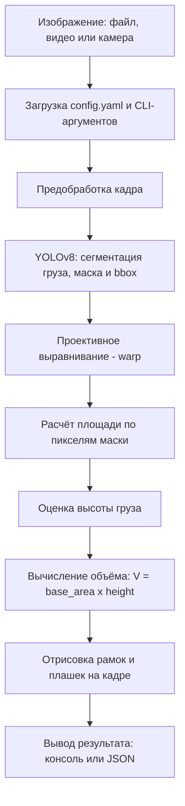

# Архитектура системы АИС для транспортной компании

## Содержание

- [Общая схема](#общая-схема)
- [Компоненты системы](#компоненты-системы)
  - [volume/cli.py — точка входа](#volumeclipy--точка-входа)
  - [volume/pipeline.py — оркестрация](#volumepipelinepy--оркестрация)
  - [volume/segmentation.py — детекция груза](#volumesegmentationpy--детекция-груза)
  - [volume/geometry.py — расчёт объёма](#volumegeometrypy--расчёт-объёма)
  - [volume/visualization.py — отрисовка результатов](#volumevisualizationpy--отрисовка-результатов)
- [Конфигурация](#конфигурация)
- [Реализованный метод расчёта объёма](#реализованный-метод-расчёта-объёма)
  - [Входные данные](#входные-данные)
  - [Предобработка и сегментация](#предобработка-и-сегментация)
  - [Расчёт объёма](#расчёт-объёма)
  - [Финальная формула](#финальная-формула)
  - [Режимы работы](#режимы-работы)
- [API системы](#api-системы)
  - [Формат ответа](#формат-ответа)
  - [Эндпоинты](#эндпоинты)
- [Схема обработки запроса](#схема-обработки-запроса)
- [Развёртывание](#развёртывание)
  - [Docker-образ](#docker-образ)
  - [Запуск без Docker](#запуск-без-docker)
- [Требования к окружению](#требования-к-окружению)

---

## Общая схема

Система построена на модульной архитектуре. Исходный код разбит на независимые модули, каждый из которых отвечает за свою часть обработки.

## Схема обработки запроса



## Компоненты системы

### volume/cli.py — точка входа

Обрабатывает аргументы командной строки и загружает конфигурацию из `config.yaml`. Позволяет переопределить любой параметр через CLI.

```bash
python volume_test.py
python volume_test.py --source C:/data/frame.jpg
python volume_test.py --source C:/data/video.mp4
python volume_test.py --source 0
```

### volume/pipeline.py — оркестрация

Управляет последовательностью обработки: получение кадра, сегментация, расчёт объёма, визуализация. Координирует вызовы всех остальных модулей в правильном порядке.

### volume/segmentation.py — детекция груза

Использует YOLOv8 (модель `best_fixed.pt`) для сегментации груза на изображении. Опционально включает фильтр людей (`yolov8n.pt`) для исключения персонала из зоны детекции. На выходе отдаёт маску груза и bbox.

### volume/geometry.py — расчёт объёма

Реализует быстрый метод расчёта объёма груза. Принимает маску и bbox от модуля сегментации. Выполняет проективное выравнивание (warp), считает площадь по пикселям маски, оценивает высоту и вычисляет итоговый объём в кубометрах.

### volume/visualization.py — отрисовка результатов

Принимает исходное изображение и результаты расчёта. Накладывает на кадр рамки вокруг груза, маску и текстовые плашки с объёмом, габаритами и статусом. Отображает результат в окне OpenCV.

## Конфигурация

Основной файл настроек — `config.yaml`. Ключевые параметры:

| Параметр | Описание |
|----------|----------|
| `source` | Путь к изображению, видео или номер камеры |
| `segmentation.model_path` | Путь к модели YOLOv8 (`best_fixed.pt`) |
| `segmentation.conf` | Порог уверенности детекции |
| `geometry.pallet_length_m` | Длина паллеты в метрах (1.2) |
| `geometry.pallet_width_m` | Ширина паллеты в метрах (0.8) |
| `geometry.camera_height_m` | Высота установки камеры |
| `geometry.warp_width` | Ширина варпа для выравнивания |
| `geometry.warp_height` | Высота варпа |
| `person_filter.enabled` | Включение фильтра людей |

## Реализованный метод расчёта объёма

### Входные данные

- Изображение склада (файл, видео или камера)
- Параметры камеры из `config.yaml`
- Обученная модель YOLOv8 (`best_fixed.pt`)

### Предобработка и сегментация

- Устранение дисторсии изображения
- Сегментация области груза моделью YOLOv8
- Выделение маски груза
- Опциональная фильтрация людей

### Расчёт объёма

1. YOLOv8 находит груз и выдаёт bbox
2. Из bbox извлекаются длина и ширина в пикселях
3. Выполняется проективное выравнивание (warp) — паллета раскладывается в прямоугольник, маска груза проецируется на варп
4. Пиксельные размеры переводятся в метры через коэффициент, полученный из размеров паллеты
5. Оценивается высота груза по данным bbox и высоте камеры

### Финальная формула

```
V = base_area_m2 x height_m
```

### Режимы работы

**С паллетой:** YOLO сегментирует паллету, находятся 4 угла, делается warp, маска проецируется, площадь считается по белым пикселям.

**Без паллеты:** используется константа 1,2 x 0,8 = 0,96 м² (размер евро-паллеты).

## API системы

Система предоставляет REST API на базе FastAPI для интеграции с внешними сервисами (WMS/TMS-системы заказчика).

### Формат ответа

API возвращает результат в формате JSON:

```json
{
  "volume_m3": 1.44,
  "dimensions": {
    "length_m": 1.2,
    "width_m": 0.8,
    "height_m": 1.5
  },
  "confidence": 0.94,
  "status": "ok",
  "pallet_detected": true,
  "processing_time_s": 1.8
}
```

| Поле | Тип | Описание |
|------|-----|----------|
| `volume_m3` | float | Объём груза в кубических метрах |
| `dimensions.length_m` | float | Длина в метрах |
| `dimensions.width_m` | float | Ширина в метрах |
| `dimensions.height_m` | float | Высота в метрах |
| `confidence` | float | Уверенность модели в детекции (0–1) |
| `status` | string | Статус обработки (`ok` или `error`) |
| `pallet_detected` | bool | Обнаружена ли паллета |
| `processing_time_s` | float | Время обработки в секундах |

### Эндпоинты

| Метод | URL | Описание |
|-------|-----|----------|
| `POST` | `/api/volume` | Загрузка изображения, возврат объёма |
| `GET` | `/api/health` | Проверка работоспособности сервиса |

## Схема обработки запроса

1. Изображение поступает из источника (файл, видео или камера)
2. Загружается конфигурация из `config.yaml` с учётом CLI-аргументов
3. Выполняется предобработка кадра
4. YOLOv8 сегментирует груз и строит маску
5. Выполняется проективное выравнивание (warp)
6. Рассчитывается площадь по пикселям маски
7. Оценивается высота груза
8. Вычисляется объём: V = base_area x height
9. На кадр накладываются рамки и плашки с результатами
10. Результат выводится в консоль или возвращается как JSON

## Развёртывание

### Docker-образ

Итоговый артефакт проекта. Содержит код приложения, обученную модель YOLOv8, все зависимости Python и файл конфигурации. Развёртывание — одной командой:

```bash
docker-compose up
```

Состав контейнеров:

| Контейнер | Назначение | Порт |
|-----------|------------|------|
| `api` | REST API (FastAPI) | 8000 |
| `web` | Веб-интерфейс (HTML + CSS) | 80 |

### Запуск без Docker

```bash
cd Volume
pip install -r requirements.txt
python volume_test.py
python volume_test.py --source C:/data/frame.jpg
python volume_test.py --source C:/data/video.mp4
python volume_test.py --source 0
```

## Требования к окружению

- Python 3.9+
- YOLOv8 (ultralytics)
- OpenCV
- PyYAML
- FastAPI (для API)
- Docker Engine 20.10+ (для контейнеризации)